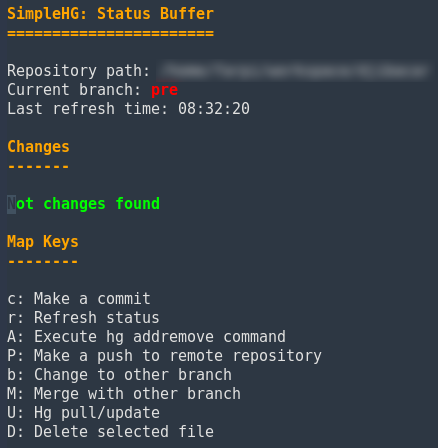

# SimpleHG

SimpleHG it's a simple plugin for emacs that allow manage mercurial repositories.

## Installation

Clone this repository inside your emacs plugins folder.

<pre>
git clone https://github.com/francescarpi/simplehg.git
</pre>

Edit your emacs configuration file, **.emacs**.

<pre>
(require 'simplehg)
(global-set-key (kbd "M-n") 'simplehg-status-buffer)
</pre>

I use this key map configuration (**M-n**), but you can use that you want.

If emacs don't find the simplehg package, check if it's in included path (**load-path**).

<pre>
(add-to-list 'load-path "<your-pagh>/simplehg")
</pre>

When you activate **simplehg-status-buffer** a buffer is created. All begins here ;)

